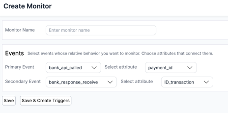
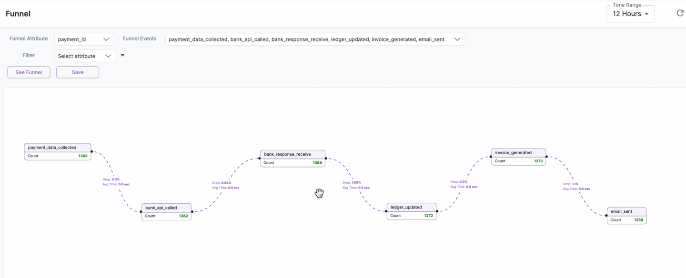
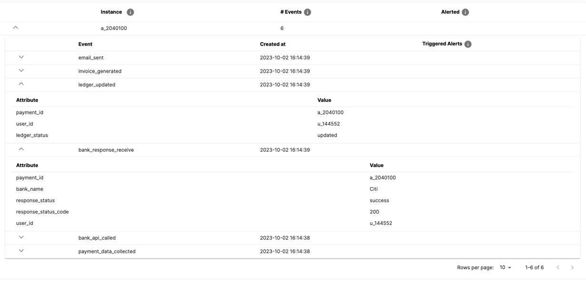

<p align="center">
  
</p>

- [ ] Todo: Define a deployable sandbox config that works in a much smaller machine (say 2GB or 4GB memory).

## Kenobi -- Open Source Log-to-Metrics & Log-to-Funnels platform

Kenobi helps you proactively monitor your application by defining correlations in your logs. Kenobi is designed to have a flexible rule-engine, easy-to-use interface and hassle-free deployment.

## Capabilities

### 1. Log to events:
You can buffer a stream of logs to Kenobi and define filters and transformations on the platform using the GROK parser built into the platform.

### 2. Event Sequences: 
Once you have events flowing in, you can define different sequences by joining them. Here are some of the examples:
1. **2-step sequence**  (defined as a monitor): Define a relation, A<sub>1</sub> &rarr; A<sub>2</sub> with A<sub>1</sub> being primary and A<sub>2</sub> being secondary event
    
1. **n-step sequence** (defined as a funnel): Define a set of events A<sub>1</sub> &rarr; A<sub>2</sub> &rarr; ... &rarr; A<sub>n</sub> that are expected to happen sequentially
   - [ ] todo -- add recording here.
   
1. **n-step trees** (defined as an entity): Define a set of events that are not necessarily sequential but inter-related
   - [ ] todo -- add recording here
   
   

### 3. Metrics:
Define aggregations on your events and sequences. Some of the allowed metric types include:
* Transition time and success rate between nodes in an event sequence or tree
* Aggregation functions on any attribute within an event
* Aggregation functions on any attribute within an event, grouped by another (enum) attribute in any other event

### 4. Alerting Rule Engine:
Kenobi enables you to create rules over your events and event sequences. Here's how the rule engine is defined:

The fastest and most reliable way to get started with Doctor Droid is signing up for free to [Doctor Droid Cloud](https://app.drdroid.io/signup). Your first 1 million events are free every month, after which you pay based on usage.

### Sandbox
Explore the platform first-hand at [Doctor Droid Sandbox](https://sandbox.drdroid.io)

### Open-source setup (Advanced)

To deploy Doctor Droid in your own environment, run the following on a Linux machine with Docker (recommended 8GB memory):

 ```bash 
  /bin/bash docker_deploy.sh
 ``` 

Post this, you can use the platform on port 80 on your host IP address. Use the following credentials for login: 
```
Username -> user@drdroid.io
Password -> password
```
Take note of the deployment hostname/IP and note the API token from the API Keys section in your portal. They will be handy when setting up integration for sending events.

Doctor Droid's open source deployment is reasonably scalable due to its micro-service architecture. In case you see difficulties in scaling it, reach out to us at [support@drdroid.io](mailto:support@drdroid.io) and we'll help you.

#### Creating sample events
You can run the in-built script for a basic payments workflow in an ecommerce company. Once your deployment is setup, set the following environment variables:
```bash
export HOST_URL=<your_deployment_ip_or_hostname> # Add http or https in it without the trailing slash
export API_TOKEN=<your_api_key>
```
Post this, you can run the basic python script that publishes events. Make sure you have python3 and pip3 installed in your environment
```bash
/bin/bash events_publish.sh
```

After your events start coming in, you can check them in the Search section. 

Few alert rules you can setup from your events:
* Event level rules:
  * Occurrence of an event
  * Occurrence of an event, more than n times (threshold)
* Sequence level rules:
  * Change in aggregated drop % between consecutive nodes
  * Change in transition times between consecutive nodes (aggregated as well as event-level configurations)
* Metric level rules:
  * Change in metric value against a static threshold
  * Change in metric value against a benchmark (previous timeline)


Here are some rules that would be possible in the platform:
* Send me an alert if node A<sub>2</sub> does not happen after node A<sub>1</sub> for every instance where attribute_value=specific_value.
* Send me an alert if more than 5% of the nodes "between" node A<sub>1</sub> and node A<sub>n</sub> are stuck at a specific node.
* Send me an alert if sequence is stuck at node A<sub>i</sub> for more than stipulated duration.

Kenobi can push alerts to itself, email and slack currently.

Sounds useful?

Play around in demo environment 👇🏽

## Exploring Kenobi in a Sandbox

For the purpose of this sandbox, we have created a sample payment application. In the sandbox, you will be able to see logs from one such application, and how we can transform it into funnels and charts.

- **Cloud Sandbox:** Play around in the cloud sandbox [here](https://sandbox.drdroid.io/) (email ID required - we will not share your PII with any external party or send you unnecessary emails)
- **Self-hosted Sandbox:** 
  - Spin a demo in your own environment, run the following on a Linux machine with Docker (recommended 2GB or 4GB memory to run the test scripts)
     ```bash 
        /bin/bash docker_deploy.sh
     ```
  - Run the test scripts using the command
     ```bash 
        /bin/bash
     ```

- [ ] Deployment commands are insufficient. Will need your inputs here.

### Integrating your log stream to Kenobi

Before being able to create funnels, metrics or rules, you need to parse data into a kenobi readable format. 

You can stream application logs into Kenobi using:
* Native events SDK (this SDK is compatible to the events format expected on the platform)
In case you want to stream from your existing sources, you can read the following documentations:
* [Cloudwatch Logs via Firehose](https://docs.drdroid.io/docs/connector-cloudwatch)
* [Segment events via Firehose](https://docs.drdroid.io/docs/connector-segment)

### Cloud Hosting
Doctor Droid supports a robust cloud platform for Kenobi. If you'd like to use the cloud platform instead of managing the platform in-house, sign up on our [website](https://app.drdroid.io/signup) or [book a demo](https://calendly.com/siddarthjain/catchup-call-clone).

### License
This repo is available under the [MIT license](https://github.com/DrDroidLab/kenobi/blob/main/LICENSE).
- [ ] Todo: Discuss [Licensing of Dependencies](https://github.com/FHPythonUtils/LicenseCheck) within the repo like Clickhouse, Kafka. Potentially explore Apache 2.0 instead of MIT.